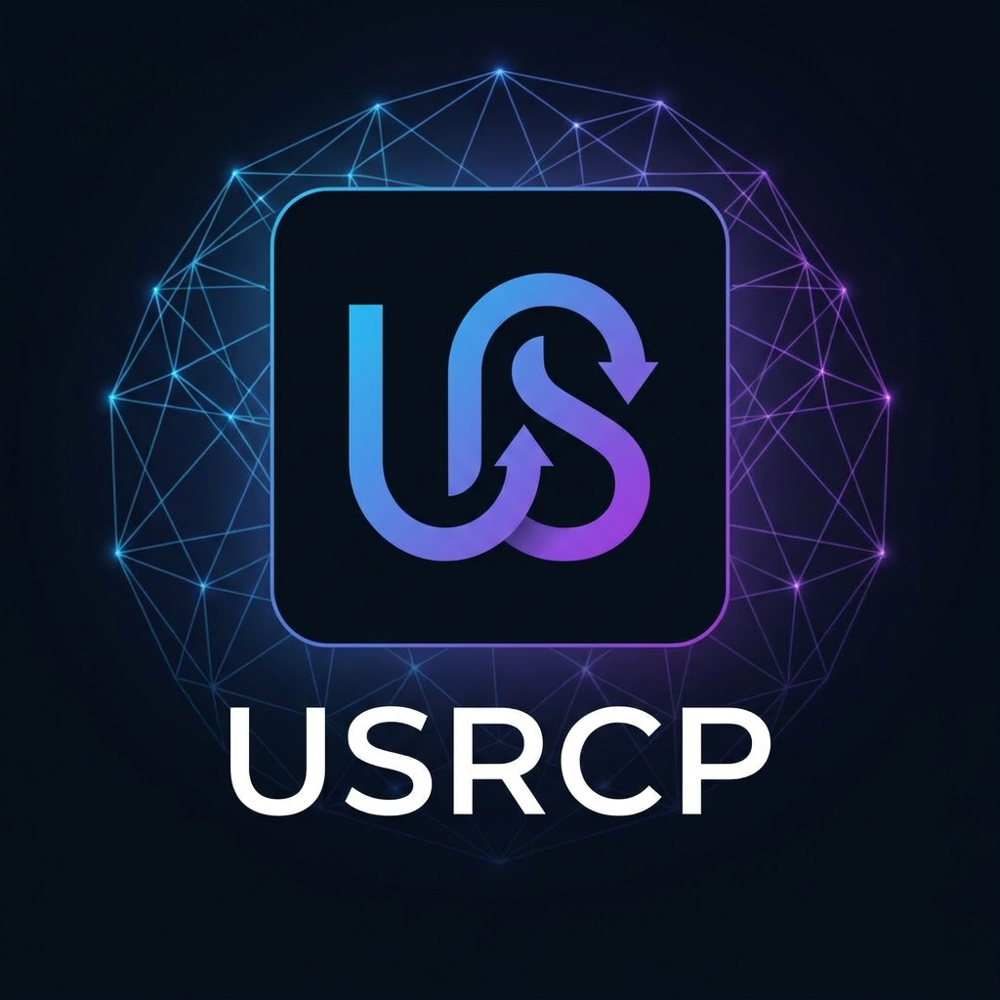

# USRCP SDK: End AI Amnesia—Sync Your Memory Across Every Channel



**Stop repeating yourself to bots.** Switch from Discord to Telegram? Your agent forgets your prefs, history, identity. That's the **amnesia gap** killing your workflow. Models route seamlessly (MCP), agents hand off (ACP)—but *your* context? Siloed and lost.

**USRCP fixes it forever.** The open protocol for agents to sync *your* state via a secure local ledger. Append in one app, query anywhere—your agent always knows you, no recap needed.

**Why devs love it (already):** 
- **Seamless sync:** Discord bot saves 'trading prefs'; Telegram picks up mid-convo. Zero friction across 10+ channels.
- **Bulletproof privacy:** AES-GCM encryption, tamper detection (fails safe), auto key rotation. Local-first—no cloud leaks.
- **Indie-friendly:** 25kB bundle, 5-min install. Free tier (1k events); Pro ($20/mo recurring via GitHub Sponsors) for unlimited/cloud sync.
- **Future-proof:** `usrcp://` URIs standardize handshakes. MCP/ACP compatible—plug into your stack.

> "USRCP is the missing link for human-AI continuity. No more 'who am I?' every session. Agents remember *you* across platforms." — Chad Garner, Creator

**Proven in wild:** 58 tests, tamper-proofed by Grok/Gemini/GPT audits. MIT licensed, battle-tested for indie agents.

## Get Started in 60 Seconds
```bash
npm i usrcp-sdk
```

```typescript
// 1. Init your ledger (auto-encrypts local DB)
import { USRCPLedger } from 'usrcp-sdk';
const ledger = new USRCPLedger({ freeCap: 1000 });

// 2. Append context from Discord (or any channel)
await ledger.appendEvent({
  type: 'user_pref',
  data: { id: 'me', pref: 'dark_mode', value: true },
  timestamp: Date.now(),
  source: 'discord'  // Track origin
});

// 3. Query anywhere—e.g., Telegram agent gets it instantly
const state = await ledger.getState({ filter: 'user_pref' });
console.log(state.myPrefs);  // { dark_mode: true } — synced!

// 4. Resolve identity (anon-safe, cross-channel)
const me = await ledger.resolveIdentity('me');
console.log(me);  // { pseudonym: 'user_xyz', events: 1, sources: ['discord'] }
```

**Run the demo:** `npx usrcp-sdk test/demo.js` — Simulates Discord→Telegram sync + tamper test. See your context flow in <10s. Outputs secure DB file ready to ship.

## Integrations That Just Work
- **OpenAI/Grok:** Built-in tool stubs—agents append/query via completions ("Save this as history? Done.").
- **Limits & Upgrade:** Hit 1k free events? Upgrade to Pro ($20/mo) via GitHub Sponsors for unlimited/cloud sync.
- **Extend Easily:** Core methods: `usrcp://append_event`, `usrcp://get_state`, `usrcp://resolve_identity`. Hook into MCP/ACP flows.

## For Devs: Quick Tech Specs
- **Stack:** TypeScript, SQLite (better-sqlite3), crypto (scrypt/AES-GCM). 58 unit tests.
- **Security:** Fail-closed on hacks, blind indexes, HMAC audits. Audited by frontier models (Grok 4.3 PASS).
- **Build/Install:** `npm run build` for prod. Full stubs in `/examples/` (OpenAI/Grok).
- **Limits:** Free: Local 1k events. Pro: Cloud sync, unlimited—webhook to Stripe.

## Join the Movement
- **Repo:** [github.com/frank-bot07/usrcp](https://github.com/frank-bot07/usrcp) — Fork, contribute, star!
- **NPM:** [usrcp-sdk](https://www.npmjs.com/package/usrcp-sdk) (v0.1.5, 27kB).
- **Discord:** Chat in #usrcp—share your wins.
- **Upgrade:** Pro tier ($20/mo)—[github.com/sponsors/frank-bot07](https://github.com/sponsors/frank-bot07).

**Built by indie devs, for indie devs.** Drop USRCP in your agent—watch context sync like magic. What's your biggest AI memory pain? Reply below.

---
*USRCP: Because your agent should know you better than you know it.*